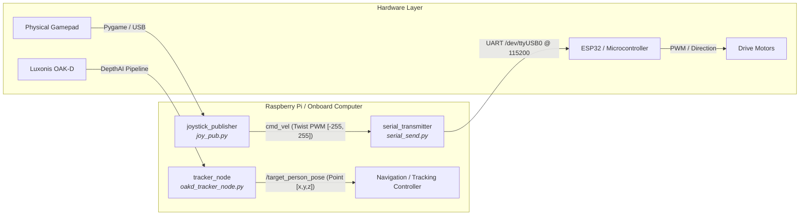
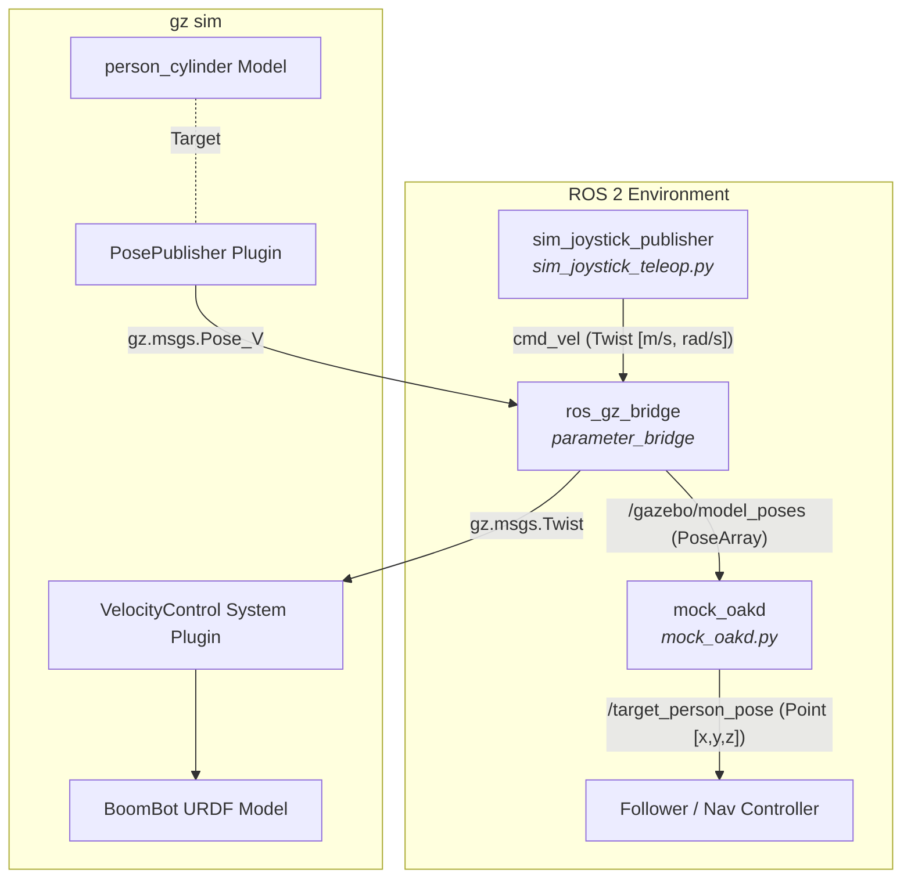

# 🤖 BoomBot: Autonomous & Teleoperated Mobile Robot Platform

BoomBot is a modular mobile robotic platform developed on **ROS 2 (Jazzy Jalisco)**. It features a complete pipeline spanning:
- **Spatial AI Computer Vision**: Hardware-accelerated 3D person tracking using a Luxonis OAK-D stereo depth camera.
- **Physical Teleoperation & Microcontroller Bridge**: Gamepad teleoperation with deadband filtering and serial ASCII telemetry to an onboard microcontroller (ESP32/Arduino).
- **Gazebo Harmonic Simulation & Digital Twin**: Full kinematic URDF model, physics plugins, ROS-Gazebo bridges, and a mathematical mock perception node for hardware-in-the-loop and software testing without physical hardware.

---

## 📑 Table of Contents
1. [System Architecture](#-system-architecture)
2. [Repository Structure](#-repository-structure)
3. [Package Deep Dive](#-package-deep-dive)
   - [1. `boombot_teleop`](#1-boombot_teleop)
   - [2. `perception`](#2-perception)
   - [3. `boombot_sim`](#3-boombot_sim)
4. [ROS 2 Topics & Interfaces](#-ros-2-topics--interfaces)
5. [Hardware Communication Protocol](#-hardware-communication-protocol)
6. [Prerequisites & Installation](#-prerequisites--installation)
7. [How to Run](#-how-to-run)
   - [Simulation Mode (Gazebo Harmonic)](#simulation-mode-gazebo-harmonic)
   - [Physical Robot Hardware Mode](#physical-robot-hardware-mode)
   - [Computer Vision Tracking (OAK-D)](#computer-vision-tracking-oak-d)
8. [Troubleshooting](#-troubleshooting)

---

## 🏛 System Architecture

BoomBot operates in two primary modes: **Physical Hardware Mode** and **Digital Twin Simulation Mode**. Both modes use the standard ROS 2 topic interface (`/cmd_vel` and `/target_person_pose`), allowing control logic and perception consumers to remain identical across real and simulated environments.

### Real Hardware Architecture


### Digital Twin Simulation Architecture


---

## 📁 Repository Structure

```text
boombot/
├── src/
│   ├── boombot_teleop/               # Hardware teleoperation & serial transport
│   │   ├── boombot_teleop/
│   │   │   ├── __init__.py
│   │   │   ├── joy_pub.py            # Reads gamepad, publishes Twist (PWM scale)
│   │   │   └── serial_send.py        # Subscribes to cmd_vel, sends ASCII to ESP32
│   │   ├── package.xml
│   │   ├── setup.cfg
│   │   └── setup.py
│   │
│   ├── perception/                   # Spatial AI computer vision
│   │   ├── perception/
│   │   │   ├── __init__.py
│   │   │   └── oakd_tracker_node.py  # Luxonis OAK-D MobileNet-SSD 3D tracker
│   │   ├── package.xml
│   │   ├── setup.cfg
│   │   └── setup.py
│   │
│   └── boombot_sim/                  # Gazebo Harmonic digital twin & URDF
│       ├── boombot_sim/
│       │   ├── __init__.py
│       │   ├── mock_oakd.py          # Ground-truth to camera-frame translation
│       │   └── sim_joystick_teleop.py# Simulation joystick (SI metric units)
│       ├── launch/
│       │   └── sim.launch.py         # Full simulation orchestrator
│       ├── urdf/
│       │   └── boombot.urdf          # Robot model, kinematics & Gazebo plugins
│       ├── package.xml
│       ├── setup.cfg
│       └── setup.py
└── README.md
```

---

## 📦 Package Deep Dive

### 1. `boombot_teleop`

Handles human teleoperation using a physical controller (Xbox, PlayStation, or generic USB HID joystick) and streams control packets to an onboard microcontroller over a serial interface.

#### 🎮 Node: `joystick_publisher` (`joy_pub.py`)
* **Executable**: `joystick_publisher`
* **Subscribes**: None (Direct Pygame joystick event polling)
* **Publishes**: `cmd_vel` ([`geometry_msgs/msg/Twist`](https://docs.ros2.org/latest/api/geometry_msgs/msg/Twist.html))
* **Execution Frequency**: 20 Hz (50 ms timer interval)
* **How It Works**:
  1. Initializes `pygame.joystick` and binds to controller index `0`.
  2. Reads input axes:
     - Axis 1 (Left Stick Y): Forward / backward velocity ($v_x$).
     - Axis 0 (Left Stick X): Lateral strafe velocity ($v_y$).
     - Axis 3 (Right Stick): Angular yaw rate ($\omega_z$).
  3. **Deadzone Filtering & Proportional Scaling**:
     A deadband threshold of `DEADZONE = 0.2` is applied to prevent joystick drift. Values outside the threshold are normalized and scaled to the integer range $[-255, 255]$:
     $$\text{magnitude} = \frac{|\text{axis}| - \text{DEADZONE}}{1.0 - \text{DEADZONE}} \times 255$$
  4. **State Caching**: The node compares the current command string `"{vx} {vy} {wz}\n"` with the previous command (`last_command`). It only publishes when the command state changes, preventing message spamming.

#### 🔌 Node: `serial_transmitter` (`serial_send.py`)
* **Executable**: `serial_transmitter`
* **Subscribes**: `cmd_vel` ([`geometry_msgs/msg/Twist`](https://docs.ros2.org/latest/api/geometry_msgs/msg/Twist.html))
* **Publishes**: None (Direct UART transmission via `pyserial`)
* **Default Port**: `/dev/ttyUSB0` at `115200` baud (1 sec timeout).
* **How It Works**:
  1. Opens serial communication and sleeps for 2 seconds to allow the microcontroller (ESP32/Arduino) to complete its hardware DTR/RTS reset cycle.
  2. Converts incoming floating-point `cmd_vel` values into integers:
     - `vx = int(msg.linear.x)`
     - `vy = int(msg.linear.y)`
     - `wz = int(msg.angular.z)`
  3. Encodes the ASCII payload `"{vx} {vy} {wz}\n"` (e.g., `255 0 -128\n`) to UTF-8 and transmits it over serial.
  4. **Failsafe / Safety Shutdown**: When the node is terminated (e.g. via `Ctrl+C` or ROS shutdown), `send_stop_command()` intercepts the exit signal, transmits `"0 0 0\n"` to immediately halt all motors, and closes the serial port cleanly.

---

### 2. `perception`

Houses the Spatial AI computer vision pipeline running on the Luxonis OAK-D stereo depth camera.

#### 👁 Node: `tracker_node` (`oakd_tracker_node.py`)
* **Executable**: `tracker_node`
* **Publishes**: `/target_person_pose` ([`geometry_msgs/msg/Point`](https://docs.ros2.org/latest/api/geometry_msgs/msg/Point.html))
* **Execution Frequency**: ~30 Hz (33 ms timer interval)
* **DepthAI Pipeline Configuration**:
  - **Color Camera (`dai.node.ColorCamera`)**: Preview stream resized to $300 \times 300$ BGR, matching the input tensor of MobileNet-SSD.
  - **Stereo Depth (`dai.node.StereoDepth`)**: Fed by two mono cameras (Left: `CAM_B`, Right: `CAM_C` at 400p). Configured with `HIGH_DENSITY` mode and depth alignment to the RGB camera sensor (`CAM_A`).
  - **Spatial Neural Network (`dai.node.MobileNetSpatialDetectionNetwork`)**:
    - Model: `mobilenet-ssd` compiled for 6 SHAVE cores (`blobconverter.from_zoo`).
    - Confidence Threshold: `0.5`.
    - Depth Calculation Bounds: $100\text{ mm}$ to $5000\text{ mm}$ ($0.1\text{ m}$ to $5.0\text{ m}$).
    - Bounding Box Scale Factor: `0.5` (samples depth from the center 50% of the detection bounding box to avoid edge bleeding).
  - **Headless Edge Optimization**: The node creates an `XLinkOut` named `"detections"` connected directly to `spatial_net.out`. Video streams (RGB/depth preview) are intentionally omitted from host transfer. All inference and depth triangulation happen entirely on the camera's Intel Movidius Myriad X VPU, sending only tiny metadata packets to the host computer (saving CPU and USB bus bandwidth on single-board computers like Raspberry Pi).
* **Output Processing**:
  - Inspects detections for `label == 15` (PASCAL VOC class ID for **Person**).
  - Converts millimeter spatial coordinates to meters:
    $$x_{\text{meters}} = \frac{x_{\text{mm}}}{1000}, \quad y_{\text{meters}} = \frac{y_{\text{mm}}}{1000}, \quad z_{\text{meters}} = \frac{z_{\text{mm}}}{1000}$$
  - Publishes a `geometry_msgs/msg/Point`:
    - `x`: Lateral offset in meters (negative = target to the left, positive = target to the right).
    - `y`: Vertical height offset in meters.
    - `z`: Longitudinal distance / depth in meters from the camera lens to the person.

---

### 3. `boombot_sim`

Provides a complete Gazebo Harmonic simulation environment for BoomBot without needing physical hardware.

#### 📐 URDF Model (`urdf/boombot.urdf`)
* **Robot Geometry**:
  - **Chassis (`base_link`)**: Blue box, dimensions $0.4\text{ m} \times 0.3\text{ m} \times 0.1\text{ m}$, mass $5.0\text{ kg}$.
  - **Wheels (4x)**: Continuous revolving cylinders ($r = 0.05\text{ m}$, $l = 0.05\text{ m}$, mass $0.5\text{ kg}$ each), positioned at $(\pm 0.2, \pm 0.175, 0.0)\text{ m}$.
  - **Frictionless Wheel Contacts**: Wheel physics materials configure `mu1 = 0.0` and `mu2 = 0.0` to eliminate wheel friction slippage and prevent physics engine chatter in velocity-controlled kinematic mode.
* **Integrated Gazebo Harmonic Plugins**:
  - `gz::sim::systems::VelocityControl`: Directly accepts `/cmd_vel` twist commands for kinematic actuation.
  - `gz::sim::systems::OdometryPublisher`: Calculates odometry at 30 Hz and broadcasts `/odom` and `/tf` coordinate transforms (`odom` $\to$ `base_link`).
  - `gz::sim::systems::PosePublisher`: Broadcasts full ground-truth poses of all models in the world (`use_pose_vector_msg = true`) at 30 Hz.

#### 🔄 Node: `mock_oakd` (`mock_oakd.py`)
* **Executable**: `mock_oakd`
* **Subscribes**: `/gazebo/model_poses` ([`geometry_msgs/msg/PoseArray`](https://docs.ros2.org/latest/api/geometry_msgs/msg/PoseArray.html))
* **Publishes**: `/target_person_pose` ([`geometry_msgs/msg/Point`](https://docs.ros2.org/latest/api/geometry_msgs/msg/Point.html))
* **How It Works (Simulated Perception)**:
  Instead of rendering synthetic camera images and running heavy GPU inference in simulation, `mock_oakd` extracts ground-truth positions of the `boombot` and the target cylinder (`person_cylinder`) from Gazebo:
  1. Computes world-frame displacement:
     $$\Delta x = x_{\text{person}} - x_{\text{robot}}, \quad \Delta y = y_{\text{person}} - y_{\text{robot}}$$
  2. Extracts the robot's current heading (yaw $\psi$) from its orientation quaternion $(w, x, y, z)$:
     $$\psi = \text{atan2}\left(2(wz + xy),\, 1 - 2(y^2 + z^2)\right)$$
  3. Applies a 2D coordinate frame rotation to transform world displacement into the robot/camera's local reference frame:
     $$\text{local\_z} = \Delta x \cos(\psi) + \Delta y \sin(\psi) \quad \text{(Depth / Forward)}$$
     $$\text{local\_x} = -\Delta x \sin(\psi) + \Delta y \cos(\psi) \quad \text{(Lateral / Horizontal)}$$
  4. Publishes `Point(x=local_x, y=0.0, z=local_z)` on `/target_person_pose`. Downstream navigation algorithms receive the exact same coordinate frame and topic format as they would from the physical OAK-D camera.

#### 🕹 Node: `sim_joystick` (`sim_joystick_teleop.py`)
* **Executable**: `sim_joystick`
* **Publishes**: `cmd_vel` ([`geometry_msgs/msg/Twist`](https://docs.ros2.org/latest/api/geometry_msgs/msg/Twist.html))
* **Execution Frequency**: 20 Hz
* **Difference from `joy_pub.py`**:
  While the hardware `joy_pub.py` outputs PWM ranges $[-255, 255]$ for microcontroller registers, `sim_joystick` maps controller inputs to physical SI metric units:
  - Linear velocity $v_x$: $[-1.0, 1.0]\text{ m/s}$
  - Lateral velocity $v_y$: $[-1.0, 1.0]\text{ m/s}$
  - Angular rate $\omega_z$: $[-2.0, 2.0]\text{ rad/s}$

#### 🚀 Launch Orchestrator (`sim.launch.py`)
Runs the full simulation stack in one command:
1. Spawns Gazebo Harmonic with an empty world (`gz sim -r empty.sdf`).
2. Spawns the `boombot` URDF model into the world via `ros_gz_sim create`.
3. Calls the Gazebo entity factory service (`/world/empty/create`) to spawn a target person cylinder (`person_cylinder`, radius $0.3\text{ m}$, height $1.0\text{ m}$ at $(2.0, 0.0, 0.5)\text{ m}$).
4. Starts `ros_gz_bridge parameter_bridge` with:
   - `/cmd_vel@geometry_msgs/msg/Twist]gz.msgs.Twist` (ROS 2 $\to$ Gazebo)
   - `/model_poses@geometry_msgs/msg/PoseArray[gz.msgs.Pose_V` remapped to `/gazebo/model_poses` (Gazebo $\to$ ROS 2)
5. Starts the `mock_oakd` node to feed local `/target_person_pose` coordinates.

---

## 📡 ROS 2 Topics & Interfaces

| Topic Name | Message Type | Publisher(s) | Subscriber(s) | Description |
| :--- | :--- | :--- | :--- | :--- |
| `cmd_vel` | `geometry_msgs/msg/Twist` | `joystick_publisher` (Hardware PWM) <br/> `sim_joystick` (Sim m/s) | `serial_transmitter` (Hardware) <br/> `ros_gz_bridge` (Simulation) | Velocity commands driving the robot base. |
| `/target_person_pose` | `geometry_msgs/msg/Point` | `tracker_node` (Physical OAK-D) <br/> `mock_oakd` (Simulation) | Target following / navigation controllers | 3D relative position of detected person (`x`: lateral, `y`: vertical, `z`: depth) in meters. |
| `/gazebo/model_poses` | `geometry_msgs/msg/PoseArray` | `ros_gz_bridge` (from Gazebo `PosePublisher`) | `mock_oakd` | Ground truth poses of all models in the simulation world. |
| `/odom` | `nav_msgs/msg/Odometry` | Gazebo `OdometryPublisher` plugin | SLAM / Nav2 / Localization nodes | Odometry state of the robot in simulation. |
| `/tf` | `tf2_msgs/msg/TFMessage` | Gazebo `OdometryPublisher` plugin | TF Tree | Transform between `odom` and `base_link`. |

---

## ⚡ Hardware Communication Protocol

The node `serial_transmitter` communicates with the motor controller (ESP32/Arduino) using a lightweight ASCII streaming protocol:

* **Baud Rate**: `115200`
* **Data Bits**: 8
* **Parity**: None
* **Stop Bits**: 1
* **Termination**: Newline character (`\n`)

### Packet Format
```text
<linear_x> <linear_y> <angular_z>\n
```

### Examples
| Action | Serial Payload Sent | Explanation |
| :--- | :--- | :--- |
| **Full Speed Forward** | `255 0 0\n` | $v_x = 255$, $v_y = 0$, $\omega_z = 0$ |
| **Full Speed Backward**| `-255 0 0\n` | $v_x = -255$, $v_y = 0$, $\omega_z = 0$ |
| **Full Speed Turn Left**| `0 0 255\n` | $v_x = 0$, $v_y = 0$, $\omega_z = 255$ |
| **Full Stop / Emergency**| `0 0 0\n` | Disables motor PWM immediately |

---

## 🛠 Prerequisites & Installation

### 1. System Requirements
- **Operating System**: Ubuntu 24.04 LTS (Noble Numbat)
- **ROS Distribution**: ROS 2 Jazzy Jalisco
- **Gazebo**: Gazebo Harmonic (`gz-sim`)
- **Python**: Python 3.12+

### 2. Install System & ROS 2 Dependencies
```bash
sudo apt update && sudo apt install -y \
  ros-jazzy-desktop \
  ros-jazzy-ros-gz \
  ros-jazzy-ros-gz-sim \
  ros-jazzy-ros-gz-bridge \
  ros-jazzy-tf2-ros \
  python3-pip \
  python3-colcon-common-extensions
```

### 3. Install Python Dependencies
```bash
pip3 install --break-system-packages \
  pygame \
  pyserial \
  depthai \
  blobconverter
```

### 4. Setup Serial Port Permissions (For Hardware)
To allow access to `/dev/ttyUSB0` without `sudo`:
```bash
sudo usermod -a -G dialout $USER
```
*(Log out and log back in for changes to take effect.)*

### 5. Setup OAK-D USB Rules (For Physical Camera)
```bash
echo 'SUBSYSTEM=="usb", ATTRS{idVendor}=="03e7", MODE="0666"' | sudo tee /etc/udev/rules.d/80-movidius.rules
sudo udevadm control --reload-rules && sudo udevadm trigger
```

### 6. Build the Workspace
Navigate to your workspace root (`c:\projects\boombot` or `~/boombot` on Linux):
```bash
cd ~/boombot
colcon build --symlink-install
source install/setup.bash
```

---

## 🚀 How to Run

### Simulation Mode (Gazebo Harmonic)

1. **Launch the Simulation World and Robot**:
   ```bash
   source install/setup.bash
   ros2 launch boombot_sim sim.launch.py
   ```
   This will start Gazebo Harmonic, spawn BoomBot, spawn the target person cylinder at `(2, 0, 0.5)`, start the ROS-GZ bridges, and run `mock_oakd`.

2. **Drive BoomBot with Gamepad in Simulation**:
   In a separate terminal:
   ```bash
   source install/setup.bash
   ros2 run boombot_sim sim_joystick
   ```

3. **Verify Target Tracking Data**:
   In another terminal:
   ```bash
   ros2 topic echo /target_person_pose
   ```
   As you drive the robot around in Gazebo, `mock_oakd` continuously publishes the person's relative distance `(x, y, z)` in the local robot frame!

---

### Physical Robot Hardware Mode

1. **Plug in Hardware**:
   - Connect the USB Gamepad to the host computer.
   - Connect the ESP32 / Arduino microcontroller via USB (`/dev/ttyUSB0`).

2. **Start the Joystick Publisher**:
   ```bash
   source install/setup.bash
   ros2 run boombot_teleop joystick_publisher
   ```

3. **Start the Serial Transmitter**:
   ```bash
   source install/setup.bash
   ros2 run boombot_teleop serial_transmitter
   ```
   Move the joystick; the transmitter will relay `"vx vy wz\n"` commands directly to the ESP32.

---

### Computer Vision Tracking (OAK-D)

1. **Plug in the Luxonis OAK-D camera via USB 3.0**.
2. **Run the Tracker Node**:
   ```bash
   source install/setup.bash
   ros2 run perception tracker_node
   ```
3. **Monitor Detected Target Pose**:
   ```bash
   ros2 topic echo /target_person_pose
   ```
   When a person enters the camera's field of view within $0.1\text{ m} - 5.0\text{ m}$, the 3D coordinates (lateral $X$, height $Y$, depth $Z$) are streamed in real time.

---

## ❓ Troubleshooting

| Issue | Cause | Solution |
| :--- | :--- | :--- |
| `NO CONTROLLER FOUND` | Gamepad is disconnected or not recognized by Pygame. | Connect joystick via USB. Verify device using `ls /dev/input/js*` or test with `jstest /dev/input/js0`. |
| `serial.SerialException: [Errno 13] Permission denied: '/dev/ttyUSB0'` | Missing user permissions for serial devices. | Run `sudo usermod -a -G dialout $USER` and reboot or log out and back in. |
| `serial.SerialException: [Errno 2] No such file or directory` | Microcontroller connected to a different port (e.g. `/dev/ttyACM0`). | Check port via `dmesg \| grep tty` and adjust `self.serial_port` in `serial_send.py`. |
| `depthai.Device() initialization failure` | Missing udev rules or insufficient USB 3 bandwidth. | Install the Movidius udev rule (see Prerequisites) and connect camera directly to a USB 3.0 (blue) port. |
| Gazebo Harmonic bridge missing `/model_poses` | Model poses topic name mismatch or bridge not running. | Verify `ros_gz_bridge` is running and check Gazebo topics using `gz topic -l`. |
| Simulation model falls through floor or drifts | Physics engine contact instabilities. | `boombot.urdf` uses frictionless wheels (`mu1=0, mu2=0`) and the `gz-sim-velocity-control-system` kinematic plugin. Ensure physics world is stepped. |

---

## 📄 License
This project is open-source under the Apache-2.0 License.
